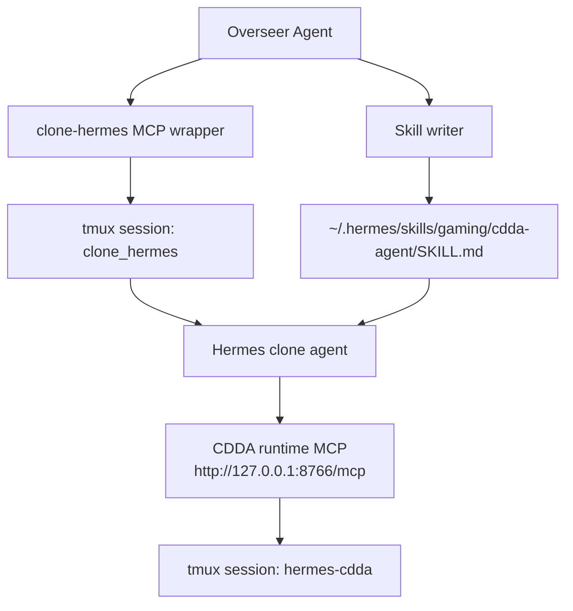

# CDDA Multi-Agent Architecture

这份文档定义 `cdda-demo/` 的下一步目标架构: 在现有 CDDA runtime MCP 之上, 增加一个可被上层 agent 控制的 `clone hermes` worker 层, 再让 `overseer` agent 通过 MCP 持续观察和调度这个 clone.

目标不是把 agent 行为写死, 而是把控制边界、状态面、恢复手段和 skill 生效路径做成薄而稳定的运行时外壳.

## Dashboard Honesty Constraint

当前 dashboard 只能诚实展示已存在的 truth surface。

- `hermes-cdda` raw panel 是底层真相源
- Human / Clone / Supervisor 当前可展示为 captured/parsed 的 structured channel views
- 在用户明确批准新的 frozen intent + mock 之前, 不要把 derived flow / inferred relation 包装成原生 contract

## Current Base

当前已经存在且可复用的底座:

- 本地 CDDA runtime 已被包装为常驻 HTTP MCP: `http://127.0.0.1:8766/mcp`
- 共享游戏 tmux session: `hermes-cdda`
- 共享 runtime tools: `session_status`, `ensure_game`, `observe`, `act`, `reach_playable`, `stop_session`
- 当前已验证: `reach_playable` 能把共享游戏推进到 `in_game`

这意味着我们现在缺的不是“怎么驱动游戏”, 而是“怎么把另一个 agent 本身变成一个可被调度的对象”.

## Target Shape

目标是三层结构:



职责切分:

- `CDDA runtime MCP` 只负责游戏状态与按键执行
- `clone hermes` 负责持续 observe → decide → act
- `clone MCP wrapper` 负责把 clone 变成上层可调度对象
- `overseer` 只观察 clone、反思、更新 skill、必要时 reset clone

## Non-Goals

这层架构不追求:

- 让 overseer 直接抢写 `hermes-cdda`
- 把 clone 的每一步决策改成同步审批
- 在第一版就做复杂多 clone 编排
- 把 skill 更新做成热加载

第一版优先把“稳定监督一个持续运行的 clone”跑通.

## Operators And Sessions

固定对象建议如下:

- clone tmux session: `clone_hermes`
- clone 使用的 MCP 连接方式: `npx mcporter call --http-url http://127.0.0.1:8766/mcp --allow-http`
- clone 运行入口:

```bash
tmux new-session -d -s clone_hermes -x 140 -y 50 'hermes'
```

- clone 启动后注入的任务:

```text
Connect to http://127.0.0.1:8766/mcp via mcporter, attach to session hermes-cdda, call reach_playable to confirm playable, then enter a CONTINUOUS EXPLORE LOOP: observe → decide → act → repeat forever. Never stop unless you die. Start the loop now.
```

- clone 输出观察:

```bash
tmux capture-pane -t clone_hermes -p
```

- 游戏画面观察:

```bash
tmux capture-pane -t hermes-cdda -p
```

- clone skill 文件:

```text
~/.hermes/skills/gaming/cdda-agent/SKILL.md
```

## Core Design Rule

最重要的运行时规则是 `single-writer`.

- `clone hermes` 是 `hermes-cdda` 的默认唯一写入者
- `overseer` 默认不直接向 `hermes-cdda` 发按键
- `overseer` 通过控制 clone 来间接影响游戏
- 只有在 clone 失控、卡死、拒绝响应、或需要紧急恢复时, overseer 才允许走 bypass 通道直接操作底层 runtime MCP

这样可以避免两层 agent 同时对同一个 curses 会话发按键, 导致状态污染.

## Required Wrapper

为了让上层 `overseer` 能持续控制 clone, 需要把 `clone_hermes + tmux` 包成一个新的 MCP server.

这个 wrapper 不直接理解 CDDA, 它只理解:

- clone 进程是否存在
- clone 当前屏幕输出是什么
- clone 最近是否还在推进
- 如何给 clone 发命令
- 如何 reset / 重启 clone
- 如何写 skill 并让 skill 在下一次 reset 后生效

一句话说, 这个 MCP 的对象不是“游戏”, 而是“玩游戏的 agent”.

## Proposed MCP Surface

第一版建议暴露这些 tools.

### `clone_status`

返回:

- tmux session 是否存在
- hermes 进程是否还活着
- 最近一次 capture 时间
- 最近一次输入任务摘要
- 当前 skill 文件路径
- 当前 skill 文件 mtime
- 当前绑定的 game session 名

### `clone_capture`

行为:

- 执行 `tmux capture-pane -t clone_hermes -p`
- 返回原始文本
- 返回轻量结构化摘要

结构化摘要建议包含:

- `phase`: `booting` / `waiting_input` / `running` / `stalled` / `errored`
- `mentions_mcp`
- `mentions_reach_playable`
- `mentions_loop`
- `last_visible_lines`

### `clone_send`

行为:

- 向 `clone_hermes` 发送一段 literal 文本
- 默认结尾补一个 `Enter`

用途:

- 给 clone 新指令
- 要求它自查
- 要求它解释当前计划

### `clone_reset`

行为:

- 向 clone 发送 `/reset`
- 可选等待 reset 完成
- 可选在 reset 后自动重灌主任务 prompt

这是 skill 生效的关键工具, 因为 `SKILL.md` 更新后需要 reset 或新 session.

### `clone_restart`

行为:

- 杀掉旧 tmux session
- 重建 `clone_hermes`
- 重新打开 `hermes`
- 注入主任务 prompt

适用于:

- clone 自己卡死
- `/reset` 无法恢复
- 需要清空上下文但保留 skill

### `clone_write_skill`

行为:

- 覆盖或 patch `~/.hermes/skills/gaming/cdda-agent/SKILL.md`
- 返回变更前后摘要

约束:

- 只允许改目标 skill 文件
- 默认先写临时文件再原子替换

### `clone_reflect`

行为:

- capture clone pane
- capture game pane
- 生成一份结构化 reflection

它本身不改 skill, 只给 overseer 一个稳定输入.

### `clone_apply_skill_and_reset`

组合工具:

1. 写 skill
2. 执行 `/reset`
3. 重新发送主任务 prompt
4. 等待 clone 回到 running

这会是 overseer 最常用的高层入口.

## Overseer Loop

`overseer` 不应该频繁人工干预 clone 的每一步, 而应该跑一个较慢的监督循环.

建议默认循环:

1. `clone_capture`
2. 读取底层 `hermes-cdda` 画面摘要
3. 判断 clone 是否在推进、是否重复、是否失控、是否自相矛盾
4. 如果正常, 只记录 observation
5. 如果异常, 生成新的 skill 约束
6. 写 skill
7. `/reset` clone 让 skill 生效
8. 继续观察

## What Overseer Should Look For

overseer 反思时重点看这些 failure modes:

- clone 明显没有真的连上 MCP, 只是在口头描述
- clone 一直重复 observe, 没有 act
- clone 连续输出相同 reasoning, 没有状态变化
- clone 在游戏内反复做无意义动作
- clone 死后停住, 没有自恢复策略
- clone 被错误弹窗、确认弹窗、或异常文本打断
- clone skill 已经过期, 无法覆盖新出现的屏幕模式

## Skill Strategy

skill 不应该写成长而脆的流程剧本, 而应该写成稳定偏好与恢复规则.

skill 内容建议分成四块:

- runtime contract
- decision policy
- recovery policy
- reporting contract

建议模板:

1. Runtime contract
   说明 clone 必须用 `mcporter` 连 `http://127.0.0.1:8766/mcp`, 使用会话 `hermes-cdda`
2. Decision policy
   说明何时 observe, 何时 act, 何时避免高风险动作
3. Recovery policy
   说明遇到死亡、错误弹窗、未知界面、长时间无变化时该怎么做
4. Reporting contract
   说明 clone 在 pane 输出里要持续暴露哪些关键行, 方便 overseer 抓取

关键点:

- skill 要偏“可监督”, 不是偏“文采”
- 输出要故意留下 machine-readable 痕迹
- overseer 需要能从 tmux capture 中看出 clone 当前意图

## Required Clone Output Contract

为了让上层监督稳定, clone 的输出需要形成一个轻量协议.

建议要求 clone 周期性输出这些前缀:

- `STATE:` 当前观察到的游戏状态
- `PLAN:` 下一步打算做什么
- `ACT:` 刚刚调用了哪个 MCP tool
- `WHY:` 为什么这样做
- `STUCK:` 为什么判断自己卡住

这样 `clone_capture` 不必理解完整自然语言, 也能稳定提取摘要.

## Control Flow

正常路径:

1. `clone_restart`
2. wrapper 注入主任务
3. clone 连接底层 CDDA MCP
4. clone `reach_playable`
5. clone 进入 explore loop
6. overseer 定期 `clone_capture`
7. overseer 只在需要时才写 skill + reset

异常路径:

1. overseer 发现 clone 输出重复或停滞
2. overseer 更新 skill 或补充临时指令
3. `clone_apply_skill_and_reset`
4. clone 重新加载 skill
5. clone 重新连接底层 MCP
6. clone 回到 explore loop

## Suggested Local Files

为了让 wrapper 稳定, 建议在 `cdda-demo/tmp/clone-hermes/` 下维护这些本地状态文件:

- `status.json`
- `last-capture.txt`
- `last-command.txt`
- `last-prompt.txt`
- `last-reflection.md`
- `skill-backup/SKILL.<timestamp>.md`

这些文件只做本地运行态, 不入 git.

## Security And Safety Boundaries

需要明确几条边界:

- clone wrapper 只允许操作指定 tmux session: `clone_hermes`
- skill writer 只允许写指定 skill 文件
- overseer 默认不允许直接往 `hermes-cdda` 发底层按键
- 如需 bypass, 应该单独 tool 并打明显标记

## Recovery Model

建议把恢复分成 3 档:

- 软恢复: `clone_send`
  适合轻微跑偏, 直接补一句指令
- 中恢复: `clone_reset`
  适合 skill 已更新, 需要重新加载
- 硬恢复: `clone_restart`
  适合 session 卡死、上下文污染严重、或 clone 根本没起来

## Implementation Plan

推荐分 4 步:

1. 先做一个本地 `clone-hermes` MCP server, 只提供 `clone_status`, `clone_capture`, `clone_send`, `clone_reset`, `clone_restart`
2. 再补 `clone_write_skill` 与 `clone_apply_skill_and_reset`
3. 然后给 overseer 写一份专用 skill, 让它按监督循环工作
4. 最后才做自动 reflection 与更复杂的策略压缩

这样可以先把“agent controlling agent”这件事做实, 再逐步加智能层.

## Minimal Success Criteria

第一版做到这些就算成功:

- 能一键拉起 `clone_hermes`
- 能通过 MCP 抓到 clone pane 输出
- 能通过 MCP 给 clone 发文本命令
- 能通过 MCP 更新 `cdda-agent` skill
- skill 更新后能通过 `/reset` 生效
- overseer 能只通过 clone MCP, 而不是手工 tmux, 持续监管 clone

## Open Questions

当前还需要尽早定下的点:

- clone 的 pane 输出要不要强制结构化前缀
- skill 更新是全量覆盖还是 patch
- overseer 的循环节奏是固定间隔还是事件驱动
- 是否允许 overseer 在 clone 死亡后自动 restart
- 是否要给 clone MCP 增加 `clone_health` / `clone_stall_detector`

## Recommended Next Artifact

这份文档之后最自然的下一步不是继续写更多文档, 而是实现一个新的脚本:

- `scripts/clone_hermes_mcp_server.py`

它的职责就是把:

- `tmux new-session -d -s clone_hermes -x 140 -y 50 'hermes'`
- `tmux capture-pane -t clone_hermes -p`
- `tmux send-keys`
- `~/.hermes/skills/gaming/cdda-agent/SKILL.md`

包装成一组 MCP tools, 供 `overseer` agent 调用.
